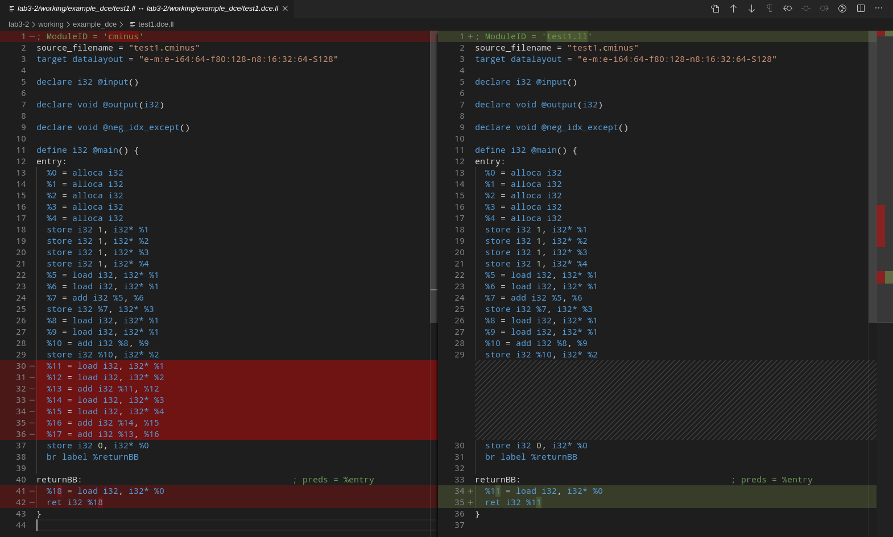
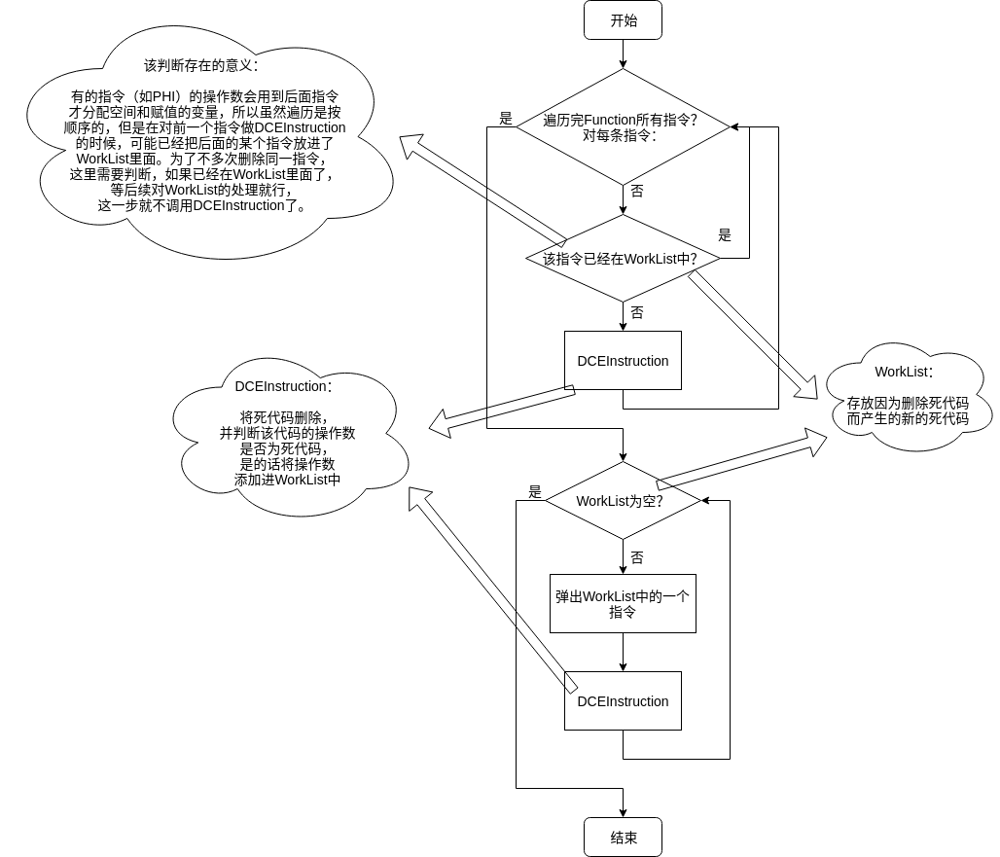
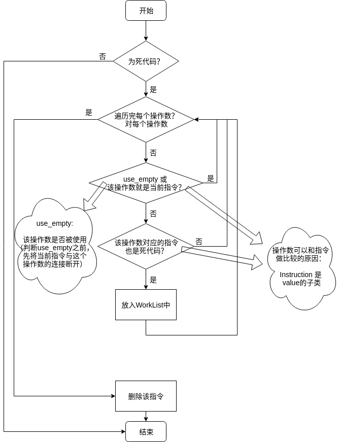
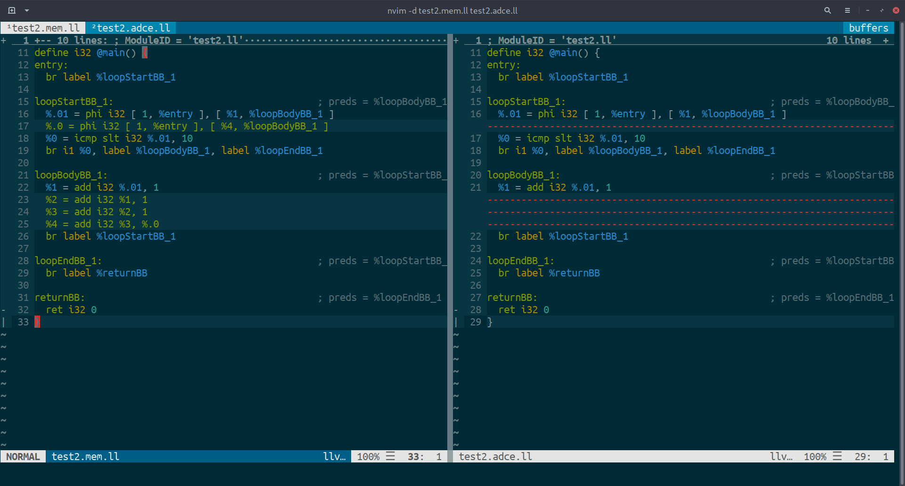

# lab3-2实验报告

小组成员 姓名 学号  
PB17000002 古宜民（队长）  
PB15081586 苏文治  
PB16001837 朱凡  


## 实验要求

通过阅读相关源代码和从LLVM官方文档中了解相关信息等，学习选定的LLVM Pass并完成报告，介绍其类型、作用、优化细节和运行流程。

## 报告内容

### Pass: dce(Dead Code Elimination)

#### 类型与作用

dce是一个较为简单的删除明显是死代码的pass，他先遍历function中的每条指令，将死指令删除，然后重新反复检查指令，寻找因为删除死指令后新出现的死代码，并删除。

#### LLVM IR优化效果

cminus程序：

```c
int main(void) {
	int a;
	int b;
	int c;
	int d;
	a = 1;
	b = 1;
	c = 1;
	d = 1;
	c = a + a;
	b = a + a;
	(a + b) + (c + d);
	return 0;
}
```

直接生成LLVM IR与经过dce优化后的对比：



可以看到，变量`%17`计算后没有使用，故`%17 = add i32 %13, %16`是死代码，先删除这一行代码。删除这一行后，dce继续检查，会发现`%16`计算后也没有使用，故`%16 = add i32 %14, %15`也是死代码，删除这一行，如此反复进行，直到`%11`-`%17`都被删除。

#### 流程

**主体流程**如下：

1.遍历找出死代码 -> 2.删除该死代码 -> 3.寻找因为删除该死代码出现的新的死代码，并加入WorkList中 -> 4.删除WorkList中的死代码，并重复步骤3



**核心函数**（删除死代码函数）流程如下：

1.判断当前指令是不是死代码，不是则直接结束 -> 2.对该指令的每个操作数，判断如果去除该指令后是不是死代码，如果是则添加进WorkList中 -> 3.删除该指令



### Pass: adce(Advanced Dead Code Elimination)

#### 类型和作用

adce同样是一个死代码删除的Pass。相对于dce直接找出死代码并删除，adce更加激进，其首先假设所有代码都是死的，再通过推导和分析找出活的代码，没有证明是活的代码会被删除。

#### LLVM IR优化效果

实验中发现，如果不使用`mem2reg`等其他Pass，很难找到adce能优化但dce不能优化的例子。于是本处使用一个经`mem2reg`优化的例子。

cminus程序：

```c
int main(void) {
	int a;
	int b;
	int c;
	int d;
	a = 1;
	b = 1;
	c = 1;
	d = 1;
	while(a < 10) {
		a = a + 1;
		d = a + b + c + d;
	}
	return 0;
}
```

只有`mem2reg`和`mem2reg`并`adce`的IR对比（`mem2reg`后`dce`没有任何效果就没有展示；为了对比方便这里放了vimdiff图片，IR代码在example_adce目录中）：



可见，adce成功地消除了循环中对变量`d`计算的代码，因为变量d在循环中计算后并未使用。

代码中，对变量`d`的计算分散在两个部分，即循环体中的计算和循环开始处初始值计算的Phi指令。由于两处指令互相引用了结果，`%4`计算中用了`%.0`，而`%.0`的计算中也用了`%4`，所以直接看上去两条代码都被其他指令引用，都不是死代码，dce也就无法删除。

但是adce通过整体分析，由于没有其他对变量`d`的引用，`%.0`和`%4`的两条指令（以及`%2`，`%3`两条计算指令）也就无法被标记为活，于是在adce中一起被删除。

从这个简单的循环例子可见，正如文档所说，adce在循环中可以找到其他dce无法找到的死代码。

#### 流程

adce作用于Function，对Function中的每个BasicBlock和每条Instruction安排了结构体`BlockInfoType`和`InstInfoType`用于记录代码的信息。类`AggressiveDeadCodeElimination`记录了分析的数据并定义了各种分析函数和辅助函数。

adce主要流程分为3步：

```flow
st=>start: Start
op1=>operation: initialize
主要任务是初始化结构体，
以及找到开始时就能确定为活的指令作为活指令查找的初始条件
op2=>operation: markLiveInstuctions
循环地从已知的活指令查找标记更多的活指令
op3=>operation: removeDeadInstructions
遍历指令，找出未被标记为活（死）的指令，并删除
e=>end

st->op1->op2->op3->e
```

数据结构


**具体流程**

以下流程图中未描述Debug信息的处理。

initialize

```flow
st=>start: Start
op1=>operation: 初始化：遍历每个BasicBlock和Instruction，更新BlockInfoType和InstInfoType数据结构
op2=>operation: 标记：简单遍历每条Instruction，使用isAlwaysLive找出开始时就能判断为活的指令并标记
op3=>operation: 标记：深度优先遍历BasicBlock，如果有回边则标记标记终结指令为活（？）
op4=>operation: 标记：查找不以return结束的BasicBlock并标记其终结指令为活（？）
op5=>operation: 标记&计算：标记开始BasicBlock为活，并计算收集终结指令为死的BasicBlock
end=>end: End

st->op1->op2->op3->op4->op5->end
```

markLiveInstructions

```flow
st=>start: Start
op1=>operation: 标记：从WorkList中取出当前已知活的Instruction，
调用markLive标记其操作数为活，如果是Phi指令则使用markPhiLive标记。
markLive同时会把指令所在的BasicBlock也标记为活，进而通过参数是BlockInfoType和Instruction的markLive递归地把BasicBlock的终结指令和等指令标记为活
op2=>operation: markLiveBranchesFromControlDependences
condi=>condition: WorkList为空？
end=>end: End

st->op1->op2->condi
condi(yes)->end
condi(no)->op1
```

removeDeadInstructions

```flow
st=>start: Start
op1=>operation: updateDeadRegions（其中使用了computeReversePostOrder（？）、makeUnconditional（？））：

op5=>operation: 删除：把被找出的死代码删除，完成整个adce流程
end=>end: End

st->op1->op5->end
```


按要求说明选择的Pass和进行相关任务的回答


## 实验总结

本次实验我们有机会阅读项目源码，

同时发现源码中使用了各种各样的C++特性和方便的自定义的数据结构，感到自己C++水平有待提升

## 实验反馈

对本次实验的建议（可选 不会评分）
